<p align="center">
  
</p>

<h1 align="center">Odoo 資源預定管理模組</h1>

<p align="center">
  <strong>Odoo 18 企業級資源預定與管理解決方案</strong><br/>
  Portal 使用者自助預定、後台行事曆管理、討論通道整合
</p>

<p align="center">
  <a href="#功能特色">功能特色</a> &bull;
  <a href="#系統架構">系統架構</a> &bull;
  <a href="#安裝說明">安裝說明</a> &bull;
  <a href="#功能截圖">功能截圖</a> &bull;
  <a href="#設定指南">設定指南</a> &bull;
  <a href="#安全機制">安全機制</a> &bull;
  <a href="#api-參考">API</a> &bull;
  <a href="#變更紀錄">更新紀錄</a> &bull;
  <a href="README.md">English</a>
</p>

<p align="center">
  
  
  
  
</p>

---

## 概述

**Odoo 資源預定管理模組** 是為 Odoo 18 打造的完整資源預定解決方案。讓 Portal 使用者能夠自助瀏覽可用資源、選擇時段、確認預定，並透過內建的討論通道與其他參加者即時協作。管理員可在後台透過行事曆視圖管理所有預定，設定資源的可用時段、存取控制、容量限制等。

<p align="center">
  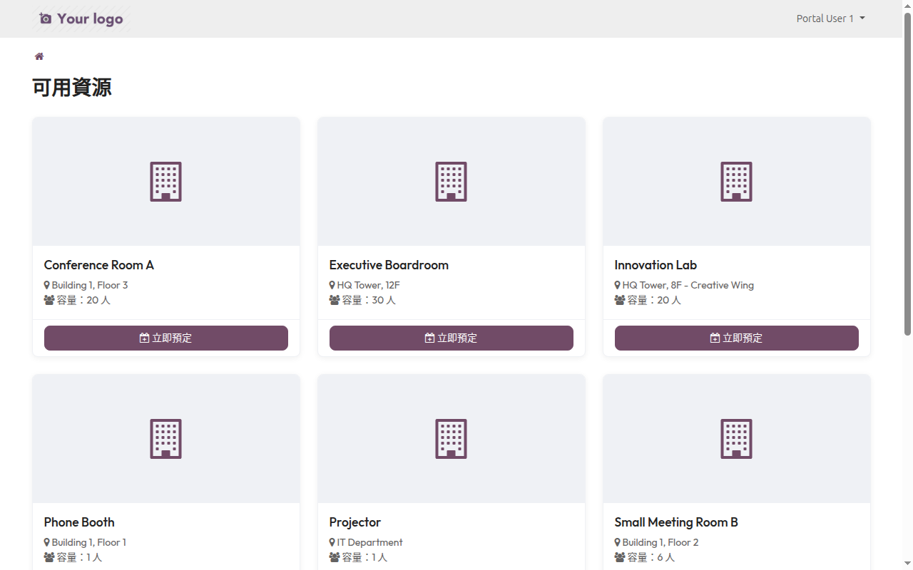
</p>

### 為什麼選擇此模組？

| 問題痛點 | 解決方案 |
|----------|----------|
| 會議室/設備預定流程繁瑣 | Portal 使用者自助線上預定，無需聯絡管理員 |
| 預定衝突難以避免 | SQL 行級鎖定（FOR UPDATE）防止並發衝突，100% 避免重複預定 |
| 缺乏統一管理介面 | 後台行事曆視圖整合，一目了然所有預定 |
| 團隊溝通分散 | 每筆預定自動建立討論通道，參加者即時協作 |
| 安全性不足 | XSS 防護、IDOR 驗證、RPC 繞過防護、Portal 記錄規則 |
| 不依賴 Website 模組 | 純 Portal 架構，輕量部署，無需安裝 Website 模組 |

---

## 功能特色

### Portal 使用者功能

- **資源瀏覽** — 卡片式介面展示所有可預定資源，包含地點、容量、說明
- **時段選擇** — 日曆風格的時段顯示，已預定時段自動標記，支援跨週翻頁
- **預定確認** — 填寫主題、說明，選擇是否開啟討論通道
- **我的預定** — 查看所有預定紀錄，支援篩選（即將到來/全部）、排序（日期）
- **預定詳情** — 完整預定資訊、取消預定、再次預定、進入討論通道
- **討論通道** — 每筆預定可建立專屬通道，與舉辦方及參加者即時溝通

### 後台管理功能

- **行事曆視圖** — 日/週/月/年 多種檢視模式，依資源顏色分類
- **資源管理** — 建立/編輯資源，設定分類、地點、容量、時段長度、間隔、可預定天數
- **可用時段** — 依星期幾設定每日可用時段（例：週一至週五 09:00-18:00）
- **存取控制** — 「所有 Portal 使用者」或「特定聯絡人」兩種模式
- **預定清單** — 列表視圖管理所有預定，支援搜尋、篩選、群組
- **進階設定** — 動態屬性（Odoo 原生功能）、資源分類、提醒通知

### 安全與穩定性

- **XSS 防護** — 所有使用者輸入透過 `html_sanitize` 處理，模板使用 `t-out` 取代 `t-raw`
- **競態條件防護** — SQL `FOR UPDATE` 行級鎖定，防止並發預定衝突
- **IDOR 防護** — 討論通道存取驗證，確保只有預定相關人員可存取
- **RPC 繞過防護** — Model 層級約束（`@api.constrains`），阻擋繞過 Controller 的直接 RPC 呼叫
- **Portal 記錄規則** — 3 條 `ir.rule` 限制 Portal 使用者只能存取授權資源
- **刪除保護** — `partner_id` 設定 `ondelete='restrict'`，防止刪除關聯預定者

---

## 系統架構

```
┌─────────────────────────────────────────────────────────────┐
│              Odoo 資源預定管理模組                            │
├─────────────────────────────────────────────────────────────┤
│                                                              │
│  ┌────────────────────────┐  ┌────────────────────────┐     │
│  │    Portal 前台         │  │     後台管理            │     │
│  │                        │  │                        │     │
│  │ • 資源瀏覽 (卡片式)   │  │ • 行事曆視圖           │     │
│  │ • 時段選擇 (日曆風格)  │  │ • 預定清單/表單        │     │
│  │ • 預定確認/取消        │  │ • 資源設定             │     │
│  │ • 我的預定列表         │  │ • 分類管理             │     │
│  │ • 討論通道整合         │  │ • 可用時段設定         │     │
│  └──────────┬─────────────┘  └──────────┬─────────────┘     │
│             │                           │                    │
│             └───────────┬───────────────┘                    │
│                         │                                    │
│  ┌──────────────────────▼──────────────────────────────┐    │
│  │                  核心模型層                           │    │
│  │                                                      │    │
│  │  booking.reservation     — 預定記錄                  │    │
│  │  booking.resource.type   — 可預定資源                │    │
│  │  booking.resource.category — 資源分類                │    │
│  │  booking.resource.availability — 可用時段            │    │
│  │                                                      │    │
│  │  安全機制：                                           │    │
│  │  • SQL FOR UPDATE 防競態條件                          │    │
│  │  • @api.constrains 模型層約束                        │    │
│  │  • ir.rule Portal 記錄規則                           │    │
│  │  • html_sanitize XSS 防護                            │    │
│  └──────────────────────┬──────────────────────────────┘    │
│                         │                                    │
├─────────────────────────┼────────────────────────────────────┤
│                         ▼                                    │
│  ┌───────────────────────────────────────────────────────┐  │
│  │                 Odoo 18 框架                           │  │
│  │  Portal │ Mail │ Calendar │ ORM │ Security             │  │
│  └───────────────────────────────────────────────────────┘  │
│                         │                                    │
│  ┌───────────────────────▼───────────────────────────────┐  │
│  │                    PostgreSQL                          │  │
│  └───────────────────────────────────────────────────────┘  │
└─────────────────────────────────────────────────────────────┘
```

### 模組依賴

```
odoo_booking_reservation
    ├── base
    ├── mail          (討論通道、郵件通知)
    ├── calendar      (行事曆視圖整合)
    ├── portal        (Portal 使用者介面)
    └── cs_portal_discuss  (Portal 討論頁面)
```

---

## 功能截圖

### Portal — 資源瀏覽

Portal 使用者可瀏覽所有可預定資源，顯示名稱、地點、容量。

<p align="center">
  
</p>

### Portal — 時段選擇

選擇資源後，以日曆風格顯示可用時段。已預定時段標記為「您的預定」。

<p align="center">
  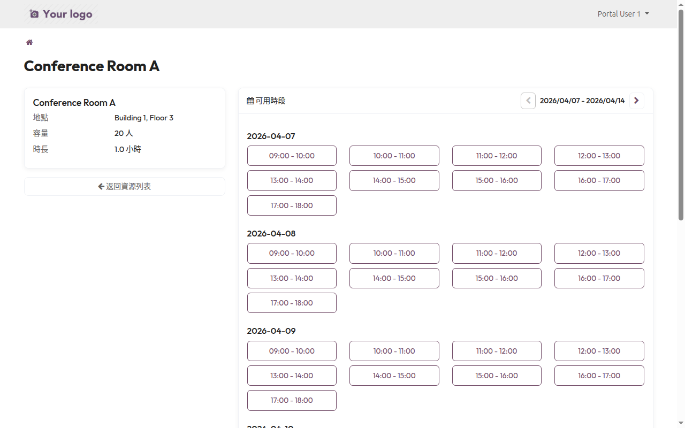
</p>

### Portal — 預定確認

填寫預定主題、說明，選擇是否建立討論通道。

<p align="center">
  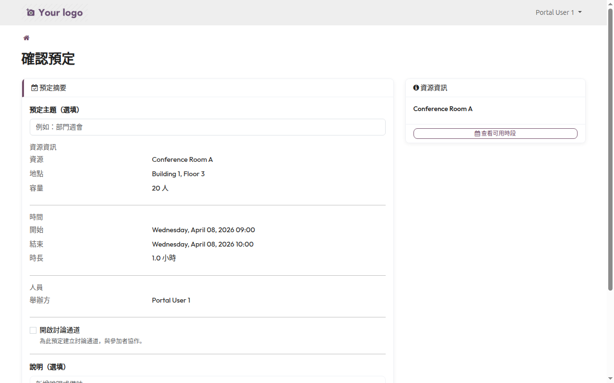
</p>

### Portal — 我的預定

查看所有預定紀錄，支援篩選和排序。

<p align="center">
  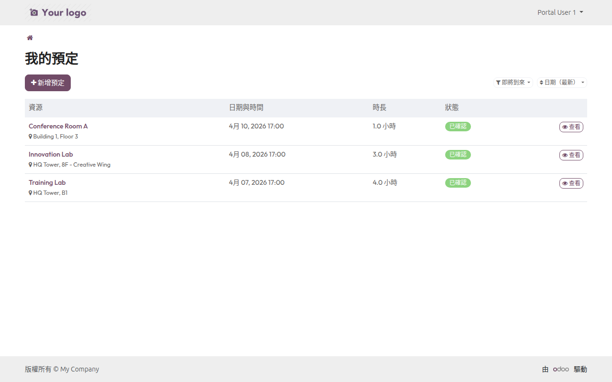
</p>

### Portal — 預定詳情

完整預定資訊，可取消預定、再次預定、進入討論通道。

<p align="center">
  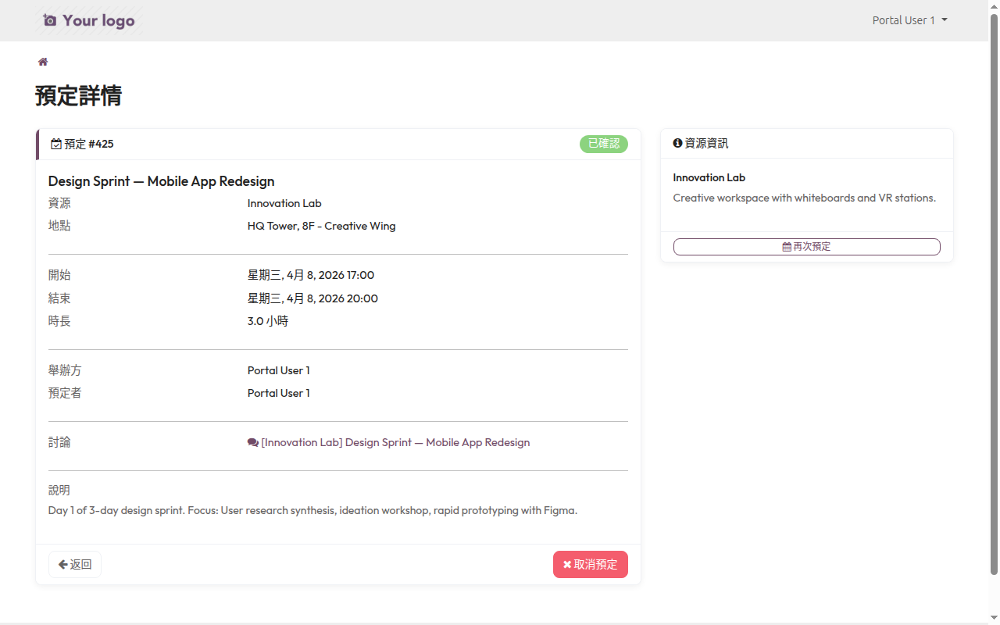
</p>

### Portal — 首頁入口

Portal 首頁顯示「我的預定」和「預定資源」兩張卡片。

<p align="center">
  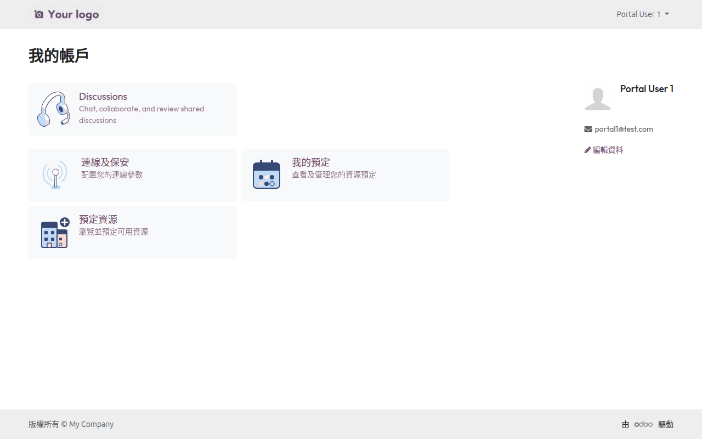
</p>

### 後台 — 行事曆視圖（月）

管理員透過行事曆月視圖總覽所有預定，依資源顏色分類。

<p align="center">
  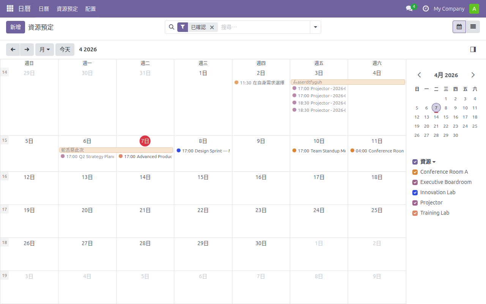
</p>

### 後台 — 行事曆視圖（週）

行事曆週視圖，顯示每日時段分佈，右側資源篩選。

<p align="center">
  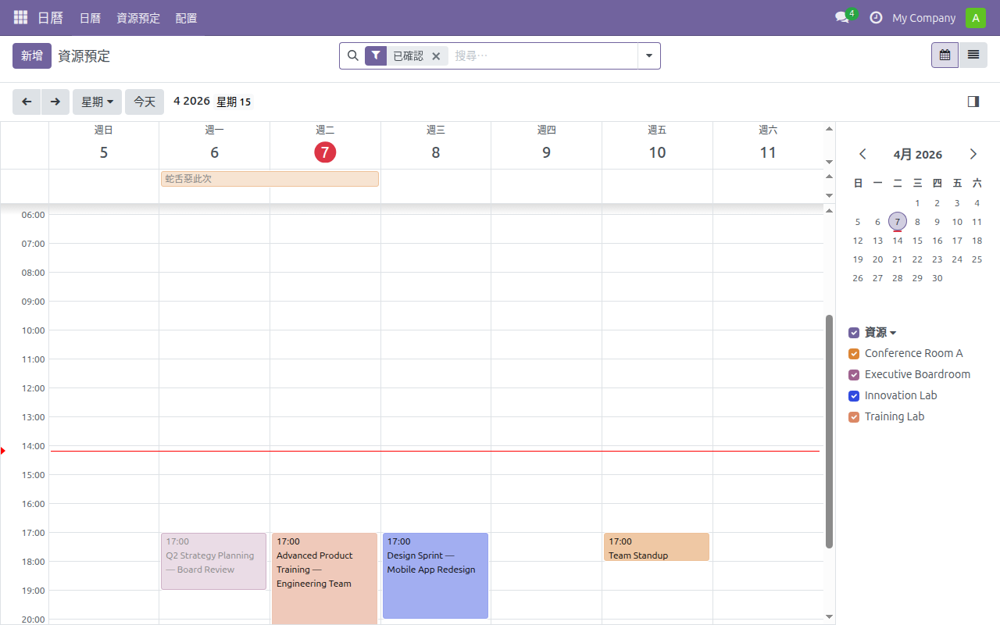
</p>

### 後台 — 預定清單

列表視圖管理所有預定，顯示名稱、資源、時間、時長、預定者、狀態。

<p align="center">
  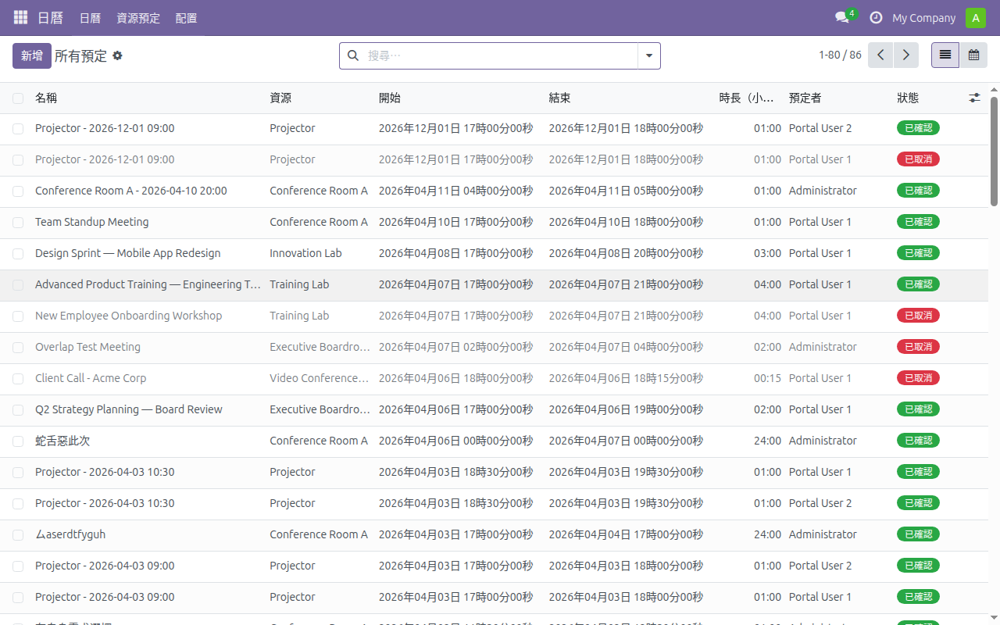
</p>

### 後台 — 預定表單

預定表單詳情，包含資源資訊、時間、人員（舉辦方/預定者/參加者）、討論通道、說明、提醒。

<p align="center">
  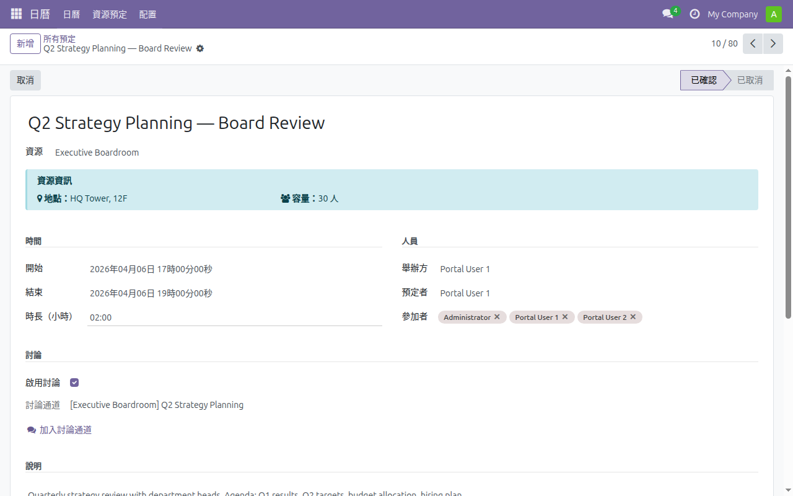
</p>

### 後台 — 資源清單

資源管理列表，顯示名稱、地點、容量、時段長度、存取類型、預定數。

<p align="center">
  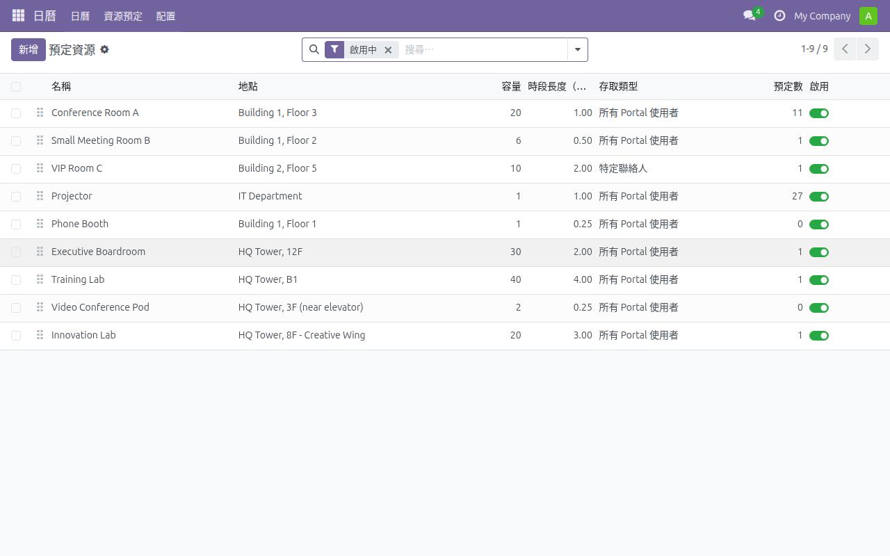
</p>

### 後台 — 資源設定

資源表單設定頁面，包含基本資訊、預定設定、說明、可用時段、存取控制、進階設定。

<p align="center">
  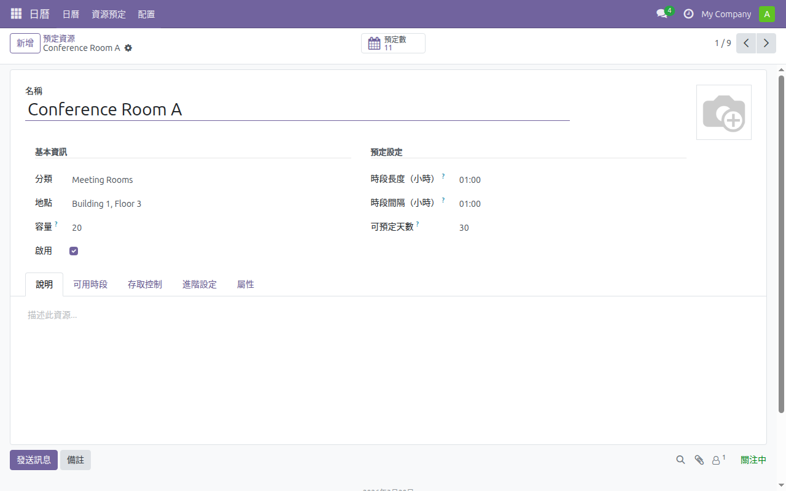
</p>

### 後台 — 可用時段設定

依星期幾設定每日可用時段，例如週一至週五 09:00-18:00。

<p align="center">
  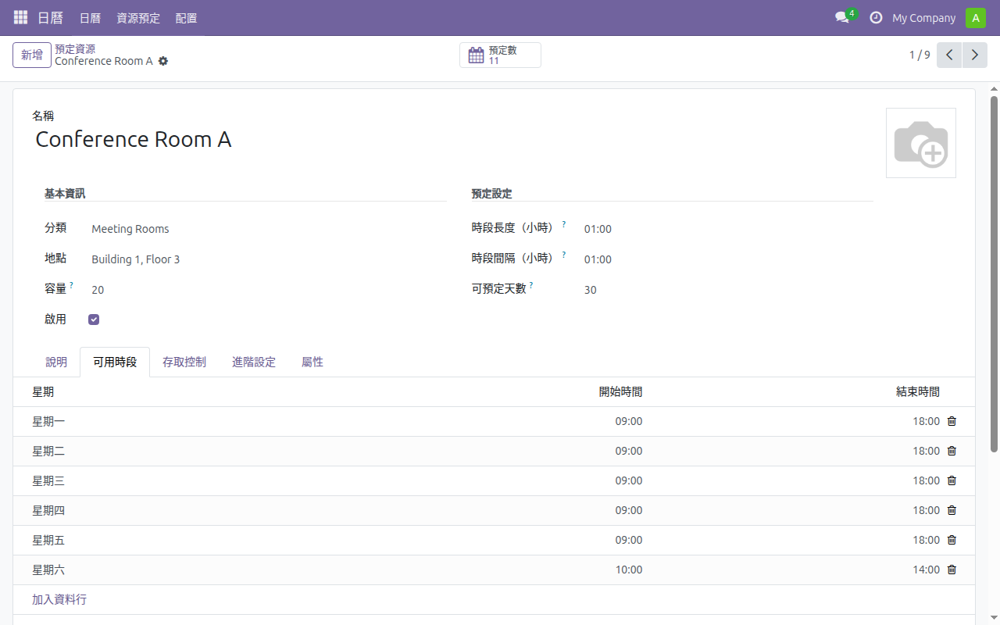
</p>

### 後台 — 存取控制

設定資源的存取類型：「所有 Portal 使用者」或「特定聯絡人」。

<p align="center">
  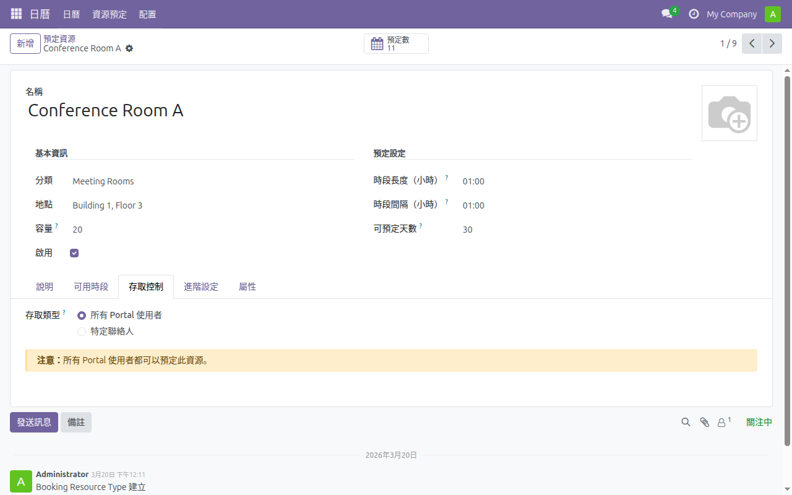
</p>

---

## 安裝說明

### 系統需求

- **Odoo 18.0**（社區版或企業版）
- **PostgreSQL 13+**
- **Python 3.10+**
- **相依模組：** `mail`, `calendar`, `portal`, `cs_portal_discuss`

### 安裝步驟

```bash
# 1. 將模組 Clone 到 Odoo addons 路徑
cd /path/to/odoo/addons/
git clone https://github.com/WOOWTECH/Woow_odoo_internal_booking.git odoo_booking_reservation

# 2. 更新模組列表並安裝
odoo -u odoo_booking_reservation -d your_database
```

### 在 Odoo 中安裝

1. 前往 **應用程式** 選單
2. 點擊 **更新應用程式列表**
3. 搜尋「資源預定管理」
4. 點擊 **安裝**

---

## 設定指南

### 1. 建立資源分類

前往 **日曆 > 配置 > 資源分類**

建立資源分類（例：會議室、設備、場地），方便管理和篩選。

### 2. 建立可預定資源

前往 **日曆 > 配置 > 預定資源**

| 欄位 | 說明 |
|------|------|
| 名稱 | 資源名稱（例：Conference Room A） |
| 分類 | 所屬分類 |
| 地點 | 資源位置 |
| 容量 | 最大容納人數 |
| 時段長度 | 每個預定時段的長度（小時） |
| 時段間隔 | 時段之間的間隔（最小 0.25 小時） |
| 可預定天數 | 允許提前預定的天數 |

### 3. 設定可用時段

在資源表單的「可用時段」分頁，依星期幾設定每日可用時間段。

### 4. 設定存取控制

在資源表單的「存取控制」分頁：
- **所有 Portal 使用者** — 所有 Portal 使用者都可預定
- **特定聯絡人** — 只有指定的聯絡人可預定

### 5. 郵件通知

模組內建兩個郵件模板：
- **預定確認** — 預定確認時自動發送
- **預定取消** — 預定取消時自動發送

---

## 安全機制

### 安全特性

| 安全項目 | 實作方式 |
|----------|----------|
| XSS 防護 | `html_sanitize()` 處理使用者輸入，`t-out` 取代 `t-raw` |
| 競態條件防護 | SQL `FOR UPDATE` 行級鎖定 |
| IDOR 防護 | 討論通道存取驗證，檢查預定擁有權 |
| RPC 繞過防護 | `@api.constrains` 模型層驗證（過去時段、重疊、時長） |
| Portal 記錄規則 | 3 條 `ir.rule` 限制 Portal 存取範圍 |
| 異常洩漏防護 | Controller 層捕捉異常，返回通用錯誤碼 |
| 刪除保護 | `ondelete='restrict'` 防止刪除關聯預定者 |
| 輸入驗證 | 日期格式驗證、範圍限制、容量/間隔最小值 |

### Portal 記錄規則

```xml
<!-- Portal 使用者只能存取啟用中且授權的資源 -->
<record id="booking_resource_type_portal_rule" model="ir.rule">
    <field name="domain_force">[
        ('active', '=', True),
        '|',
        ('share_type', '=', 'all'),
        ('allowed_partner_ids', 'in', [user.partner_id.id]),
    ]</field>
    <field name="groups" eval="[(4, ref('base.group_portal'))]"/>
</record>
```

---

## 技術細節

### 模型結構

| 模型 | 說明 | 關鍵欄位 |
|------|------|----------|
| `booking.reservation` | 預定記錄 | resource_type_id, start/end_datetime, partner_id, state, channel_id |
| `booking.resource.type` | 可預定資源 | name, category_id, capacity, slot_duration, slot_interval, share_type |
| `booking.resource.category` | 資源分類 | name, description |
| `booking.resource.availability` | 可用時段 | resource_type_id, dayofweek, hour_from, hour_to |

### 模型約束（`@api.constrains`）

| 約束 | 說明 |
|------|------|
| `_check_no_overlap` | SQL FOR UPDATE 防止重複預定 |
| `_check_duration_matches_slot` | 驗證預定時長與資源時段長度一致 |
| `_check_not_in_past` | 阻擋過去時段的預定 |
| `_check_capacity` | 資源容量至少為 1 |
| `_check_slot_settings` | 時段間隔最小 0.25 小時 |
| `_check_availability_overlap` | 防止可用時段重疊 |

### 效能優化

- **`_read_group` 聚合查詢** — 計算預定數和資源數，取代 `len(filtered())` 模式
- **SQL 原生查詢** — 重疊檢查使用原生 SQL + `FOR UPDATE`，避免 ORM 開銷

---

## API 參考

### Portal HTTP 端點

所有路由需要已認證的 Portal 使用者（`auth='user'`）。

| 端點 | 方法 | 說明 |
|------|------|------|
| `/my/booking/resources` | GET | 瀏覽所有可預定資源 |
| `/my/booking/resources/<id>` | GET | 資源詳情與可用時段 |
| `/my/booking/resources/<id>/slots` | JSON | 取得可用時段（參數：`date_from`, `date_to`） |
| `/my/bookings/new` | GET | 新預定表單 |
| `/my/bookings/confirm` | GET | 預定確認頁面 |
| `/my/bookings/create` | POST | 建立新預定 |
| `/my/bookings` | GET | 我的預定列表（參數：`page`, `sortby`, `filterby`） |
| `/my/bookings/<id>` | GET | 預定詳情頁面 |
| `/my/bookings/<id>/cancel` | POST | 取消已確認的預定 |
| `/my/bookings/<id>/discuss` | GET | 進入預定的討論通道 |
| `/my/discussions` | GET | Portal 討論列表（含 IDOR 防護） |

### 關鍵模型方法

```python
# booking.reservation
reservation.action_cancel()         # 取消已確認的預定
reservation.action_confirm()        # 重新確認已取消的預定
reservation.action_open_discuss_channel()  # 開啟討論通道

# booking.resource.type
resource._check_partner_access(partner)    # 檢查聯絡人是否可預定
resource._generate_slots(date_from, date_to)  # 產生可用時段
resource.action_view_reservations()        # 開啟預定行事曆視圖
```

### 郵件模板

| 模板 ID | 觸發時機 | 說明 |
|---------|----------|------|
| `mail_template_booking_confirmed` | `create()` | 預定確認郵件，包含資源詳情、時間、操作按鈕 |
| `mail_template_booking_cancelled` | `action_cancel()` | 取消通知郵件，附帶重新預定連結 |

---

## 測試

本模組經過多階段完整測試：

### 功能測試結果

| 階段 | 測試項目 | 通過 | 失敗 | 通過率 |
|------|---------|------|------|--------|
| Portal 端對端測試 | 66 | 66 | 0 | 100% |
| 後台 CRUD 與行事曆 | 48 | 48 | 0 | 100% |
| 安全性與邊界案例 | 48 | 48 | 0 | 100% |
| **總計** | **162** | **162** | **0** | **100%** |

### 上線前審計

23 項安全與穩定性審計：

| 類別 | 項目 | 狀態 |
|------|------|------|
| XSS 防護 | 模板清理、`t-out` 強制使用 | 已修復 |
| 競態條件 | SQL `FOR UPDATE` 鎖定 | 已修復 |
| IDOR 驗證 | 討論通道存取檢查 | 已修復 |
| RPC 繞過防護 | `@api.constrains` 模型層防護 | 已修復 |
| Portal 記錄規則 | 3 條 `ir.rule` 資源/預定存取規則 | 已修復 |
| 輸入驗證 | 過去時段阻擋、重疊檢測、容量檢查 | 已修復 |
| 刪除保護 | `ondelete='restrict'` 關聯保護 | 已修復 |
| 效能優化 | `_read_group` 聚合、SQL 優化 | 已修復 |

所有 23 項發現均在正式上線前完成修復。

---

## 變更紀錄

### v1.0.0 (2026-04)

- **安全性：** 上線前 23 項安全審計 — XSS、競態條件、IDOR、RPC 繞過、記錄規則全數修復
- **增強：** 過去時段驗證 — `@api.constrains` 阻擋過去時段預定
- **增強：** 可用時段重疊檢測 — 防止同資源的可用時段衝突
- **增強：** 效能優化 — `_read_group` 聚合查詢取代 `len(filtered())` 模式
- **增強：** 刪除保護 — `ondelete='restrict'` 防止孤立記錄
- **在地化：** 完整繁體中文介面 — 所有視圖、模板、控制器、錯誤訊息、欄位標籤
- **修正：** 討論對話視窗 — 純 DOM 操作確保關閉按鈕可靠運作
- **修正：** 時區處理 — 時段產生正確轉換使用者時區與 UTC
- **修正：** Portal 首頁卡片圖示與排版對齊

### v0.9.0 (2026-03)

- **功能：** 日曆風格預定表單，含主題、舉辦方、參加者、討論通道整合
- **功能：** Portal 品牌重設計 — 套用 Woowtech 品牌色系與字體
- **功能：** 預定自動建立討論通道，加入參加者成員
- **功能：** 郵件通知模板 — 預定確認與取消通知
- **測試：** 162/162 完整測試通過（100%）

### v0.1.0 (2026-02)

- **首次發布：** Odoo 18 完整資源預定模組
- **功能：** Portal 自助資源瀏覽、時段選擇、預定確認
- **功能：** 後台行事曆視圖，支援日/週/月/年模式
- **功能：** 資源管理，含分類、容量、可用時段、存取控制
- **功能：** 預定列表分頁、排序、篩選

---

## 授權條款

本專案採用 **LGPL-3** 授權條款。

---

## 支援

- **公司：** [WOOWTECH](https://woowtech.com)
- **Email：** gt.apps.odoo@gmail.com
- **Issues：** [GitHub Issues](https://github.com/WOOWTECH/Woow_odoo_internal_booking/issues)

---

<p align="center">
  <sub>Built with care by <a href="https://github.com/WOOWTECH">WOOWTECH</a> &bull; Powered by Odoo 18</sub>
</p>
